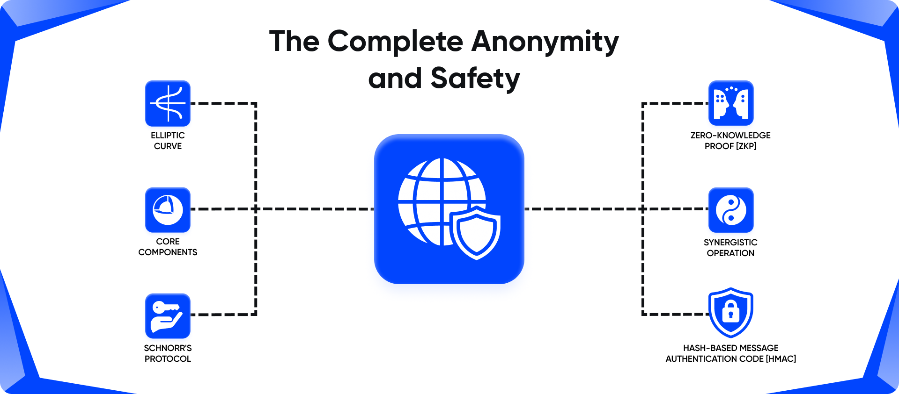
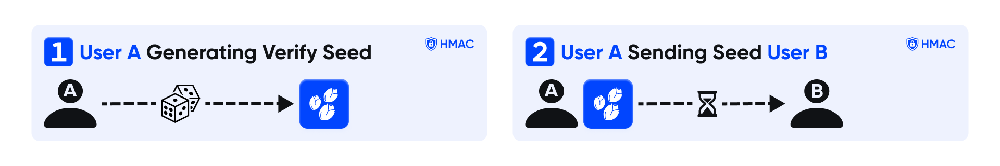
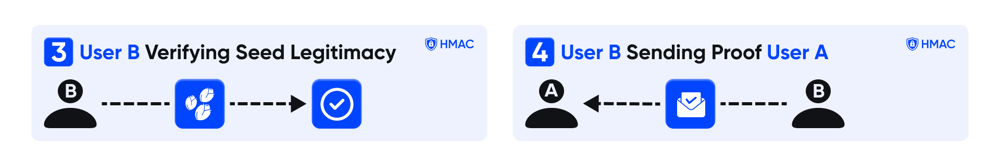
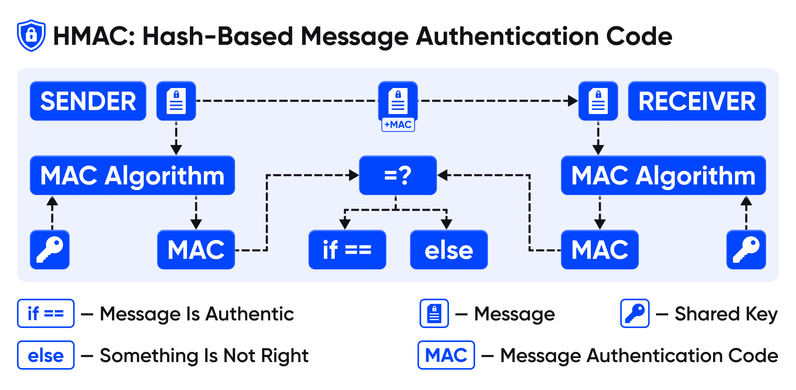
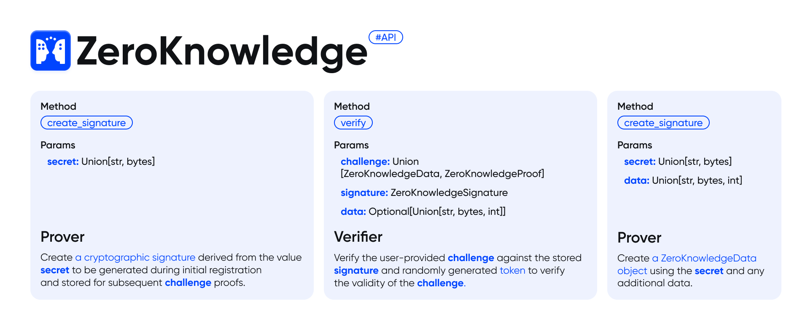

  

<h1 align="center">zk-Call & Labs</h1>

  <strong>"Zero-Knowledge" Proof Implementation with HMAC Communication in Python</strong>

 

  

  
    Built by <a href="https://github.com/zk-Call"> zk-Call</a> :)
  

 

# Table of Contents
- [Credits](#credits)
- [Purpose](#purpose)
- [How it Works](#how-it-works)
- [API](#api)
- [Example Usage](#example-usage)
 

# Credits

This repository hosts a refined implementation of [**Schnorr's protocol**](https://en.wikipedia.org/wiki/Schnorr_signature) , innovatively incorporating a state seed for enhanced security measures. While the underlying proofs may appear intricate, I aim to elucidate their functionality to the best of my ability. However, for a deeper understanding, I encourage referencing the seminal research papers underpinning this implementation, as they offer comprehensive insights.

---

 
 

**For further exploration:**

[**Elliptic Curve Based "Zero-Knowledge" Proofs and Their Applicability on Resource Constrained Devices by Ioannis Chatzigiannakis, Apostolos Pyrgelis, Paul G. Spirakis, and Yannis C. Stamatiou**](https://arxiv.org/pdf/1107.1626.pdf)

---

 

Additionally, this repository delves into the concepts of **"Zero-Knowledge" Proofs (ZKPs)** and **Hash-based Message Authentication Codes (HMACs)**. **ZKPs** are cryptographic protocols that allow one party **(the prover)** to prove to another party **(the verifier)** that a given statement is true, without revealing any additional information beyond the validity of the statement itself. This property is particularly valuable for preserving privacy while establishing trust.
 

On the other hand, **HMACs** are a type of cryptographic hash function used for message authentication. They involve a cryptographic hash function **(such as SHA-256)** and a secret cryptographic key. **HMACs** provide a way to verify both the data integrity and the authenticity of a message, ensuring that it has not been altered or tampered with during transmission and that it indeed originates from the purported sender.
 
 

# Purpose

In today's rapidly evolving IT and application development landscape, **"Zero-Knowledge" Proofs (ZKPs)** emerge as a pivotal paradigm for authentication security. Their capacity to affirm the validity of a claim, such as proving possession of a secret password — without revealing any sensitive information about the claim itself, such as passwords or hashes, revolutionizes the assurance of secure AAA operations (authentication, authorization, and accounting).

---

 

**zk-Call & Labs** represents an implementation of a [**Non-Interactive "Zero-Knowledge" Proof**](https://en.wikipedia.org/wiki/Non-interactive_zero-knowledge_proof) **(NIZKP)** protocol tailored specifically for validating text-based secrets. This framework proves invaluable for safeguarding passwords and other authentication mechanisms, ensuring robust security measures without compromising privacy. Additionally, the integration of **HMAC (Hash-Based Message Authentication Code)** further fortifies the authentication process, enhancing data integrity and thwarting potential security breaches.
 
 

# How It Works

The authentication protocol employed in this system operates based on two fundamental concepts:
**"Zero-Knowledge" Proofs (ZKPs)** and **Hash-Based Message Authentication Code (HMAC)**. Let's delve into each of these components and understand how they synergize to ensure secure authentication in messaging applications.
 

"Zero-Knowledge" Proofs (ZKPs)
---

#### **"Zero-Knowledge" Proofs (ZKPs):** 
**ZKPs** form the bedrock of privacy-preserving authentication mechanisms. These proofs allow one party **(the prover)** to demonstrate the validity of a claim to another party **(the verifier)** without revealing any additional information beyond the claim's validity. In essence, **ZKPs** enable authentication without the need for the prover to disclose sensitive data, such as passwords or cryptographic keys.

---

 

#### **Application in Authentication:** 
In the context of messaging applications, **ZKPs** play a pivotal role in verifying a user's identity without the need to transmit explicit credentials over the network. Instead, users can generate cryptographic proofs attesting to their identity or possession of certain credentials without exposing those credentials themselves. This ensures that sensitive information remains confidential during the authentication process, bolstering security and privacy.
 
 

Hash-Based Message Authentication Code (HMAC)
---

#### **Hash-Based Message Authentication Code (HMAC):**
**HMAC** provides a robust mechanism for verifying the integrity and authenticity of messages exchanged between parties. It involves the use of a cryptographic hash function in conjunction with a secret key to generate a unique code **(the HMAC)** for each message. This code serves as a digital signature, allowing the recipient to verify that the message has not been tampered with or altered during transmission.

---

#### **Application in Authentication:**
In messaging applications, **HMAC** can be employed to authenticate message senders and ensure the integrity of communication channels. By appending an **HMAC** to each message using a shared secret key, both the sender and recipient can validate the message's authenticity upon receipt. Any unauthorized modifications to the message would result in a mismatch between the **computed HMAC** and the **received HMAC**, thereby alerting the recipient to potential tampering.
 
 

Synergistic Operation:
---
When combined, **"Zero-Knowledge" Proofs** and **HMAC** create a formidable framework for secure authentication in messaging applications. **ZKPs** facilitate identity verification without divulging sensitive information, while **HMAC** ensures the integrity and authenticity of messages exchanged between parties. Together, these mechanisms uphold the confidentiality, integrity, and authenticity of communication channels, safeguarding users' privacy and security in the digital realm.

---

 
 

# API

The **`"Zero-Knowledge"`** Python API is meant to be simple and intuitive: 

## Core Components
The **`Core Components`** are key for establishing a secure and efficient framework for cryptographic protocols; streamlining the creation and validation of **"Zero-Knowledge" Proofs (ZKPs)**. They enhance anonymous, data-safe proof validations.

---

#### ZeroKnowledge.models.ZeroKnowledgeParams:
The parameters used to initialize the **"Zero-Knowledge"** crypto system.

    class ZeroKnowledgeParams(NamedTuple):
        """
        Parameters used to construct a Zero-Knowledge Proof state using an curve and a random salt
        """
        algorithm: str                    # Hashing algorithm name
        curve: str                  # Standard Elliptic Curve name to use
        s: int                      # Random salt for the state

#### ZeroKnowledge.models.ZeroKnowledgeSignature:
A crytographic **"Zero-Knowledge"** signature that can be used to verify future messages.

    class ZeroKnowledgeSignature(NamedTuple):
        """
        Cryptographic public signature used to verify future messages
        """
        params: ZeroKnowledgeParams       # Reference ZeroKnowledge Parameters
        signature: int              # The public key derived from your original secret

#### ZeroKnowledge.models.ZeroKnowledgeProof:
A cryptograpgic proof that can be verified against a signature.

    class ZeroKnowledgeProof(NamedTuple):
        """
        Non-deterministic cryptographic Zero-Knowledge Proof that can be verified to ensure the
        private key used to create the proof is the same key used to generate the signature
        """
        params: ZeroKnowledgeParams        # Reference ZeroKnowledge Parameters
        c: int                      # The hash of the signed data and random point, R
        m: int                      # The offset from the secret `r` (`R=r*g`) from c * Hash(secret)

#### ZeroKnowledge.models.ZeroKnowledgeData
Wrapper that contains a proof and the necessary data to validate the proof against a signature.

    class ZeroKnowledgeData(NamedTuple):
        """
        Wrapper to contain data and a signed proof using the data
        """
        data: Union[str, bytes, int]
        proof: ZeroKnowledgeProof

---

## ZeroKnowledge
The **`ZeroKnowledge`** class is the central component of **`ZeroKnowledge`** and its state (defined by **`ZeroKnowledgeParams`**) should be inherently known to both the Client (Prover) and Server (Verifier).

---

#### Instance Methods
<table>
  <tr>
    <th width="9%">Method</th>
    <th width="46%">Params</th>
    <th width="10%">Role</th>
    <th width="35%">Purpose</th>
  </tr>
  <tr>
    <td><code>create_signature</code></td>
    <td><code>secret: Union[str, bytes]</code></td>
    <td>Prover</td>
    <td>Create a cryptographic signature derived from the value <code>secret</code> to be generated during initial registration and stored for subsequent challenge proofs.</td>
  </tr>
  <tr>
    <td><code>sign</code></td>
    <td><code>secret: Union[str, bytes]</code>   <code>data: Union[str, bytes, int]</code></td>
    <td>Prover</td>
    <td>Create a <code>ZeroKnowledgeData</code> object using the <code>secret</code> and any additional data.
  </tr>
  <tr>
    <td><code>verify</code></td>
    <td><code>challenge: Union[ZeroKnowledgeData, ZeroKnowledgeProof]</code>   <code>signature: ZeroKnowledgeSignature</code>   <code>data: Optional[Union[str, bytes, int]]</code></td>
    <td>Verifier</td>
    <td>Verify the user-provided <code>challenge</code> against the stored <code>signature</code> and randomly generated <code>token</code> to verify the validity of the challenge.</td>
  </tr>
</table>

---

# Example Usage
TODO: Include **`Example Usage`**

## Example 1

    """
    Extremely simple example of hmac
    """
    from queue import Queue
    from threading import Thread
    from src.Hmac.core import HmacClient
    from src.SeedGeneration.core import SeedGenerator
    
    DEBUG = True
    
    
    def print_msg(who: str, message: str) -> None:
        """
        Function to print debug messages. Prints the message only if the DEBUG flag is set to True.
    
        Args:
            who (str): Identifier of the message sender.
            message (str): Message to print.
        """
        if DEBUG:
            print(f'[{who}] {message}\n')
    
    
    def client(client_socket: Queue, server_socket: Queue):
        """
        Function representing the client logic.
    
        Args:
            client_socket (Queue): Queue for data exchange between the client and server.
            server_socket (Queue): Queue for data exchange between the server and client.
        """
        # Generating the main seed
        main_seed = SeedGenerator(phrase="job").generate()
    
        # Creating an instance of HmacClient for encrypting messages
        obj = HmacClient(algorithm="sha256", secret=main_seed, symbol_count=1)
    
        # Sending the main seed to the server
        server_socket.put(main_seed)
    
        # Checking if the server has successfully received the seed
        if client_socket.get() == obj.encrypt_message(''):
            # If successful, send a message to the server
            message = 'hello'
            server_socket.put(obj.encrypt_message_by_chunks(message))
            print_msg('client', f'client sent message {message}')
    
            # Checking if the server has successfully decrypted the message
            if client_socket.get() == obj.encrypt_message(message):
                print_msg('client', 'server has decrypt message')
    
    
    def server(server_socket: Queue, client_socket: Queue):
        """
        Function representing the server logic.
    
        Args:
            server_socket (Queue): Queue for data exchange between the server and client.
            client_socket (Queue): Queue for data exchange between the client and server.
        """
        # Receiving the main seed from the client
        main_seed = server_socket.get()
    
        # Creating an instance of HmacClient for encrypting messages
        obj = HmacClient(algorithm="sha256", secret=main_seed, symbol_count=1)
    
        # Sending an empty message to the client as acknowledgment
        client_socket.put(obj.encrypt_message(''))
    
        # Receiving the encrypted message from the client
        msg = server_socket.get()
        print_msg('server', f'msg encrypted {msg}')
    
        # Decrypting the message
        msg_raw = obj.decrypt_message_by_chunks(msg)
        print_msg('server', f'msg raw {msg_raw}')
    
        # Sending the encrypted message back to the client
        client_socket.put(obj.encrypt_message(msg_raw))
    
    
    def main():
        """
        Main function to run the client and server threads.
        """
        client_socket, server_socket = Queue(), Queue()
        threads = []
        threads.append(Thread(target=client, args=(client_socket, server_socket)))
        threads.append(Thread(target=server, args=(server_socket, client_socket)))
    
        # Starting the threads
        for thread in threads:
            thread.start()
    
        # Joining the threads to wait for their completion
        for thread in threads:
            thread.join()
    
    
    if __name__ == "__main__":
        main()

---

## Example 2

    """
    Extremely simple example of ZeroKnowledge
    """
    from src.ZeroKnowledge.core import ZeroKnowledge
    from src.ZeroKnowledge.models import ZeroKnowledgeSignature, ZeroKnowledgeData
    from queue import Queue
    from threading import Thread
    
    DEBUG = True
    
    
    def print_msg(who: str, message: str) -> None:
        """
        Function to print debug messages.
    
        Args:
            who (str): Identifier of the message sender.
            message (str): Message to print.
        """
        if DEBUG:
            print(f'[{who}] {message}\n')
    
    
    def client(client_socket: Queue, server_socket: Queue):
        """
        Function representing the client logic.
    
        Args:
            client_socket (Queue): Queue for data exchange between the client and server.
            server_socket (Queue): Queue for data exchange between the server and client.
        """
        # Creating a ZeroKnowledge object for the client with specified curve and hash algorithm
        client_object = ZeroKnowledge.new(curve_name="secp256k1", hash_alg="sha3_256")
        idenity = 'John'
    
        # Creating a signature for the client identity
        signature = client_object.create_signature(idenity)
    
        # Sending the signature to the server
        server_socket.put(signature.to_json())
        print_msg('client', f'its signature {signature.to_json()}')
    
        # Receiving token from the server
        token = client_socket.get()
        print_msg('client', f'its token {token}')
    
        # Generating proof using client identity and token
        proof = client_object.sign(idenity, token).to_json()
        print_msg('client', f'proof {proof}')
    
        # Sending proof to the server
        server_socket.put(proof)
    
        # Receiving result from the server
        result = client_socket.get()
        print_msg('client', f"{result}")
    
    
    def server(server_socket: Queue, client_socket: Queue):
        """
        Function representing the server logic.
    
        Args:
            server_socket (Queue): Queue for data exchange between the server and client.
            client_socket (Queue): Queue for data exchange between the client and server.
        """
        # Setting the server password
        server_password = "SecretServerPassword"
    
        # Creating a ZeroKnowledge object for the server with specified curve and hash algorithm
        server_zk = ZeroKnowledge.new(curve_name="secp384r1", hash_alg="sha3_512")
    
        # Creating a signature for the server password
        server_signature: ZeroKnowledgeSignature = server_zk.create_signature(server_password)
    
        # Receiving client signature from the client
        sig = server_socket.get()
        client_signature = ZeroKnowledgeSignature.from_json(sig)
        print_msg('server', f'its client signature {client_signature.to_json()}')
    
        # Creating a ZeroKnowledge object for the client using client signature parameters
        client_zk = ZeroKnowledge(client_signature.params)
        print_msg('server', f'its client_zk {client_zk}')
    
        # Generating a token signed by the server for the client
        token = server_zk.sign(server_password, client_zk.token())
        print_msg('server', f'its token {token}')
    
        # Sending the token to the client
        client_socket.put(token.to_json())
    
        # Receiving proof from the client
        proof = ZeroKnowledgeData.from_json(server_socket.get())
        print_msg('server', f'its proof {proof}')
    
        # Verifying the received proof
        token = ZeroKnowledgeData.from_json(proof.data)
        print_msg('server', f'its token {token}')
        server_verif = server_zk.verify(token, server_signature)
        print_msg('server', f'its server_verif {server_verif}')
    
        # If server verification fails, notify the client
        if not server_verif:
            client_socket.put(False)
        else:
            # Otherwise, verify the proof using client signature
            client_verif = client_zk.verify(proof, client_signature, data=token)
            print_msg('server', f'its client_verif {client_verif}')
            client_socket.put(client_verif)
    
    
    def main():
        """
        Main function to run the client and server threads.
        """
        client_socket, server_socket = Queue(), Queue()
        threads = []
        threads.append(Thread(target=client, args=(client_socket, server_socket)))
        threads.append(Thread(target=server, args=(server_socket, client_socket)))
    
        # Starting the threads
        for thread in threads:
            thread.start()
    
        # Waiting for threads to finish execution
        for thread in threads:
            thread.join()
    
    
    if __name__ == "__main__":
        main()

---
        
## Example 3

    """
    Extremely simple example of ZeroKnowledge and hmac together
    """
    from src.ZeroKnowledge.core import ZeroKnowledge
    from src.ZeroKnowledge.models import ZeroKnowledgeSignature, ZeroKnowledgeData
    from queue import Queue
    from threading import Thread
    from src.Hmac.core import HmacClient
    from src.SeedGeneration.core import SeedGenerator
    
    DEBUG = True
    
    
    def print_msg(who: str, message: str) -> None:
        if DEBUG:
            print(f'[{who}] {message}\n')
    
    
    def client(client_socket: Queue, server_socket: Queue):
        # Initializing a ZeroKnowledge object for the client with specified curve and hash algorithm
        client_object = ZeroKnowledge.new(curve_name="secp256k1", hash_alg="sha3_256")
    
        # Generating a main seed for encryption
        main_seed = SeedGenerator(phrase="job").generate()
    
        # Defining the client's identity
        idenity = 'John'
    
        # Creating a signature for the client's identity
        signature = client_object.create_signature(idenity)
    
        # Sending the signature to the server via server_socket
        server_socket.put(signature.to_json())
        print_msg('client', f'its signature {signature.to_json()}')
    
        # Receiving a token from the server via client_socket
        token = client_socket.get()
        print_msg('client', f'its token {token}')
    
        # Generating a proof of identity using the client's identity and token
        proof = client_object.sign(idenity, token).to_json()
        print_msg('client', f'proof {proof}')
    
        # Sending the proof to the server via server_socket
        server_socket.put(proof)
    
        # Receiving a result from the server via client_socket
        result = client_socket.get()
        print_msg('client', f"{result}")
    
        # If the result is True, proceed with further communication steps
        if result:
            # Sending the main seed to the server
            server_socket.put(main_seed)
    
            # Initializing an HmacClient object for message encryption/decryption
            obj = HmacClient(algorithm="sha256", secret=main_seed, symbol_count=1)
    
            # Verifying an empty message received from the server
            if client_socket.get() == obj.encrypt_message(''):
                # Sending a message to the server
                message = 'hello'
                server_socket.put(obj.encrypt_message_by_chunks(message))
                print_msg('client', f'client sent message {message}')
    
                # Verifying if the server has decrypted the message correctly
                if client_socket.get() == obj.encrypt_message(message):
                    print_msg('client', 'server has decrypt message')
    
    
    def server(server_socket: Queue, client_socket: Queue):
        # Defining the server's password
        server_password = "SecretServerPassword"
    
        # Initializing a ZeroKnowledge object for the server with specified curve and hash algorithm
        server_zk = ZeroKnowledge.new(curve_name="secp384r1", hash_alg="sha3_512")
    
        # Creating a signature for the server's password
        server_signature: ZeroKnowledgeSignature = server_zk.create_signature(server_password)
    
        # Receiving the client's signature from the client via server_socket
        sig = server_socket.get()
        client_signature = ZeroKnowledgeSignature.from_json(sig)
        print_msg('server', f'its client signature {client_signature.to_json()}')
    
        # Initializing a ZeroKnowledge object for the client using client signature parameters
        client_zk = ZeroKnowledge(client_signature.params)
        print_msg('server', f'its client_zk {client_zk}')
    
        # Generating a token signed by the server for the client
        token = server_zk.sign(server_password, client_zk.token())
        print_msg('server', f'its token {token}')
    
        # Sending the token to the client via client_socket
        client_socket.put(token.to_json())
    
        # Receiving a proof from the client via server_socket
        proof = ZeroKnowledgeData.from_json(server_socket.get())
        print_msg('server', f'its proof {proof}')
    
        # Verifying the received proof
        token = ZeroKnowledgeData.from_json(proof.data)
        print_msg('server', f'its token {token}')
    
        # Verifying the token and the server signature
        server_verif = server_zk.verify(token, server_signature)
        print_msg('server', f'its server_verif {server_verif}')
    
        # If server verification fails, notify the client
        if not server_verif:
            client_socket.put(False)
        else:
            # Otherwise, verify the proof using the client signature
            client_verif = client_zk.verify(proof, client_signature, data=token)
            print_msg('server', f'its client_verif {client_verif}')
            client_socket.put(client_verif)
    
            # Receiving the main seed from the client via server_socket
            main_seed = server_socket.get()
    
            # Initializing an HmacClient object for message encryption/decryption using the received main seed
            obj = HmacClient(algorithm="sha256", secret=main_seed, symbol_count=1)
    
            # Sending an empty message to the client
            client_socket.put(obj.encrypt_message(''))
    
            # Receiving an encrypted message from the client via server_socket
            msg = server_socket.get()
            print_msg('server', f'msg encrypted {msg}')
    
            # Decrypting the message
            msg_raw = obj.decrypt_message_by_chunks(msg)
            print_msg('server', f'msg raw {msg_raw}')
    
            # Sending the decrypted message back to the client
            client_socket.put(obj.encrypt_message(msg_raw))
    
    
    def main():
        """
        Main function to run the client and server threads.
        """
        client_socket, server_socket = Queue(), Queue()
        threads = []
        threads.append(Thread(target=client, args=(client_socket, server_socket)))
        threads.append(Thread(target=server, args=(server_socket, client_socket)))
    
        # Starting the threads
        for thread in threads:
            thread.start()
    
        # Joining the threads to wait for their completion
        for thread in threads:
            thread.join()
    
    
    if __name__ == "__main__":
        main()
